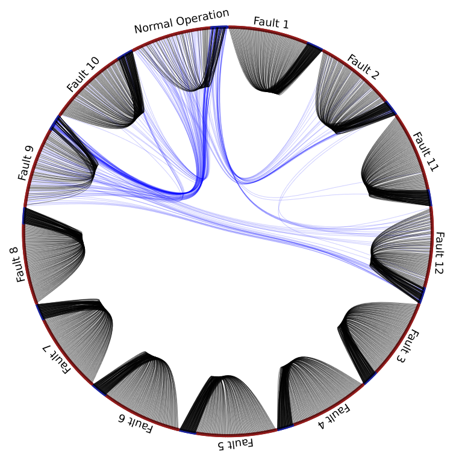
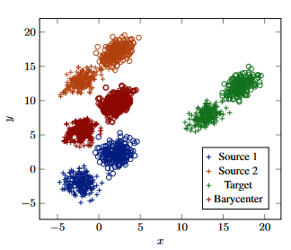
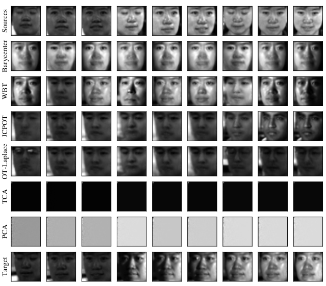
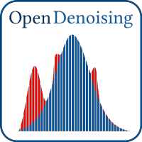

A summary of my recent work is available at [Google Scholar](https://scholar.google.com.br/citations?user=elSROdcAAAAJ&hl=en).

## Thesis

### 2021

<table cellspacing="10">
<tr>
    <td>
        
    </td>
    <td>  
        

            Montesuma, E. F. (2021, April). <b>Cross-Domain Fault Diagnosis through Optimal Transport</b> Bachelor Thesis, <a href="https://www.ufc.br/">Universidade Federal do Ceará</a>.
             
            <a href="https://www.researchgate.net/publication/354664416_Cross-Domain_Fault_Diagnosis_Through_Optimal_Transport">[Research Gate]</a> <a href="https://github.com/eddardd/CrossDomainFaultDiagnosis">[Code]</a> <a href="https://eddardd.github.io/files/Papers/montesuma2021crossdomain.bibtex">[Bibtex]</a>
        

    </td>
</tr>
</table>

## Conference Papers

### 2022

<table cellspacing="10">
<tr>
    <td>
        
    </td>
    <td>  
        

            Montesuma, E. F., Mulas, M., Corona, F., & Mboula, F. M. N. (2022). <b>Cross-domain fault diagnosis through optimal transport for a CSTR process</b>. IFAC-PapersOnLine, 55(7), 946-951.
             
            <a href="https://www.sciencedirect.com/science/article/pii/S2405896322009727">[Science Direct]</a> <a href="https://github.com/eddardd/CrossDomainFaultDiagnosis">[Code]</a> <a href="https://raw.githubusercontent.com/eddardd/my-personal-blog/master/files/papers/montesuma2022cdfd.bibtex">[Bibtex]</a>
        

    </td>
</tr>
</table>

### 2021

<table cellspacing="10">
<tr>
    <td>
        
    </td>
    <td>  
        

            Montesuma, E. F., & Mboula, F. M. N. (2021, June). <b>Wasserstein Barycenter Transport for Acoustic Adaptation</b>. In ICASSP 2021-2021 IEEE International Conference on Acoustics, Speech and Signal Processing (ICASSP) (pp. 3405-3409).
             
            <a href="https://ieeexplore.ieee.org/document/9414199">[IEEE Explore]</a> <a href="https://github.com/eddardd/WBTransport">[Code]</a> <a href="https://raw.githubusercontent.com/eddardd/eddardd.github.io/master/files/papers/wbt2021icassp.bibtex">[Bibtex]</a>
        

    </td>
</tr>
</table>

<table cellspacing="10">
<tr>
    <td>
        
    </td>
    <td>  
        

            Montesuma, E., & Mboula, F. (2021). <b>Wasserstein Barycenter for Multi-Source Domain Adaptation</b>. In Proceedings of the IEEE/CVF Conference on Computer Vision and Pattern Recognition (CVPR) (pp. 16785-16793).
             
            <a href="https://openaccess.thecvf.com/content/CVPR2021/papers/Montesuma_Wasserstein_Barycenter_for_Multi-Source_Domain_Adaptation_CVPR_2021_paper.pdf">[Paper]</a> <a href="https://github.com/eddardd/WBTransport">[Code]</a> <a href="https://raw.githubusercontent.com/eddardd/eddardd.github.io/master/files/papers/wbt2021cvpr.bibtex">[Bibtex]</a>
        

    </td>
</tr>
</table>

### 2020

<table cellspacing="10">
<tr>
    <td>
        
    </td>
    <td>  
        

            Lemarchand, F., Montesuma, E. F., Pelcat, M., & Nogues, E. (2020, May). <b>OpenDenoising: an Extensible Benchmark for Building Comparative Studies of Image Denoisers</b>. In ICASSP 2020-2020 IEEE International Conference on Acoustics, Speech and Signal Processing (ICASSP) (pp. 2648-2652). IEEE.
             
            <a href="https://arxiv.org/pdf/1910.08328.pdf">[Paper]</a> <a href="https://github.com/opendenoising/opendenoising-benchmark">[Code]</a> <a href="https://eddardd.github.io/files/Papers/opendenoising.bibtex">[Bibtex]</a>
        

    </td>
</tr>
</table>

### 2017

Montesuma, E., Alencar, L., & Barreto, G. (2017). __Avaliação de Algoritmos de Classificação de Padrões na Detecção de Câncer do Colo do Útero__. In VIII Simpósio de Instrumentação e Imagens Médicas (SIIM) / VII Simpósio de Processamento de Sinais (SPS).\
[[Paper]](https://eventos.ufabc.edu.br/siimsps/files/id74.pdf) [[Bibtex]](https://eddardd.github.io/files/Papers/siscolo.bibtex)