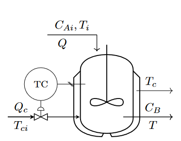

A summary of my recent work is available at [Google Scholar](https://scholar.google.com.br/citations?user=elSROdcAAAAJ&hl=en).

## Thesis

### 2021

Montesuma, E. F. (2021, April). __Cross-Domain Fault Diagnosis through Optimal Transport__ [Bachelor Thesis, Universidade Federal do Ceará].
[[Research Gate]](https://www.researchgate.net/publication/354664416_Cross-Domain_Fault_Diagnosis_Through_Optimal_Transport) [[Code]](https://github.com/eddardd/CrossDomainFaultDiagnosis) [[Bibtex]](https://eddardd.github.io/files/Papers/montesuma2021crossdomain.bibtex)

## Conference Papers

### 2022

Montesuma, E. F., Mulas, M., Corona, F., & Mboula, F. M. N. (2022). Cross-domain fault diagnosis through optimal transport for a CSTR process. IFAC-PapersOnLine, 55(7), 946-951.\
[[Science Direct]](https://www.sciencedirect.com/science/article/pii/S2405896322009727) [[Code]](https://github.com/eddardd/CrossDomainFaultDiagnosis) [[Bibtex]](https://raw.githubusercontent.com/eddardd/my-personal-blog/master/files/papers/montesuma2022cdfd.bibtex)

### 2021

Montesuma, E. F., & Mboula, F. M. N. (2021, June). __Wasserstein Barycenter Transport for Acoustic Adaptation__. In ICASSP 2021-2021 IEEE International Conference on Acoustics, Speech and Signal Processing (ICASSP) (pp. 3405-3409).\
[[IEEE Explore]](https://ieeexplore.ieee.org/document/9414199) [[Code]](https://github.com/eddardd/WBTransport) [[Bibtex]](https://eddardd.github.io/files/Papers/wbt2021icassp.bibtex)

Montesuma, E., & Mboula, F. (2021). __Wasserstein Barycenter for Multi-Source Domain Adaptation__. In Proceedings of the IEEE/CVF Conference on Computer Vision and Pattern Recognition (CVPR) (pp. 16785-16793).\
[[The CVF Open Access]](https://openaccess.thecvf.com/content/CVPR2021/html/Montesuma_Wasserstein_Barycenter_for_Multi-Source_Domain_Adaptation_CVPR_2021_paper.html) [[Paper]](https://openaccess.thecvf.com/content/CVPR2021/papers/Montesuma_Wasserstein_Barycenter_for_Multi-Source_Domain_Adaptation_CVPR_2021_paper.pdf) [[Supplementary]](https://openaccess.thecvf.com/content/CVPR2021/supplemental/Montesuma_Wasserstein_Barycenter_for_CVPR_2021_supplemental.pdf) [[Code]](https://github.com/eddardd/WBTransport) [[Bibtex]](https://eddardd.github.io/files/Papers/wbt2021cvpr.bibtex)

### 2020

Lemarchand, F., Montesuma, E. F., Pelcat, M., & Nogues, E. (2020, May). __OpenDenoising: an Extensible Benchmark for Building Comparative Studies of Image Denoisers__. In ICASSP 2020-2020 IEEE International Conference on Acoustics, Speech and Signal Processing (ICASSP) (pp. 2648-2652). IEEE.\
[[Arxiv]](https://arxiv.org/pdf/1910.08328.pdf) [[Code]](https://github.com/opendenoising/opendenoising-benchmark) [[Bibtex]](https://eddardd.github.io/files/Papers/opendenoising.bibtex)

### 2017

Montesuma, E., Alencar, L., & Barreto, G. (2017). __Avaliação de Algoritmos de Classificação de Padrões na Detecção de Câncer do Colo do Útero__. In VIII Simpósio de Instrumentação e Imagens Médicas (SIIM) / VII Simpósio de Processamento de Sinais (SPS).\
[[Paper]](https://eventos.ufabc.edu.br/siimsps/files/id74.pdf) [[Bibtex]](https://eddardd.github.io/files/Papers/siscolo.bibtex)